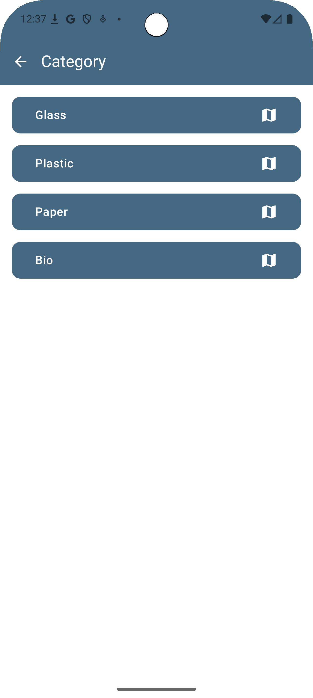
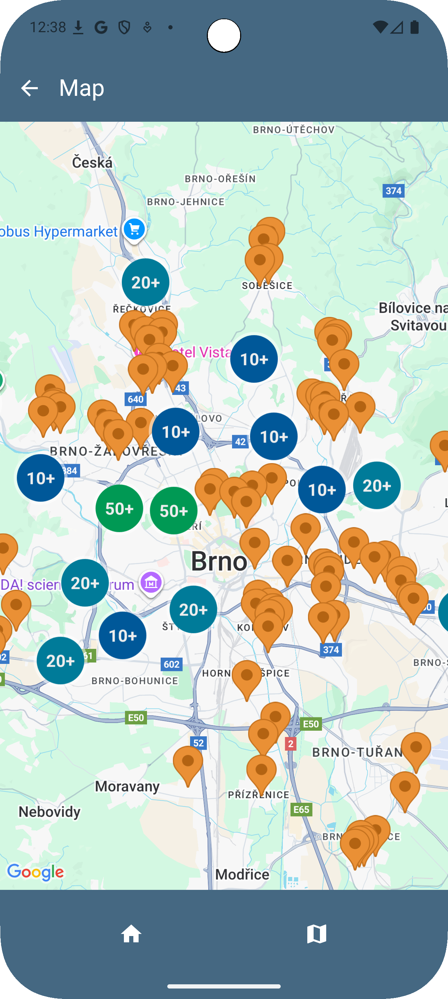
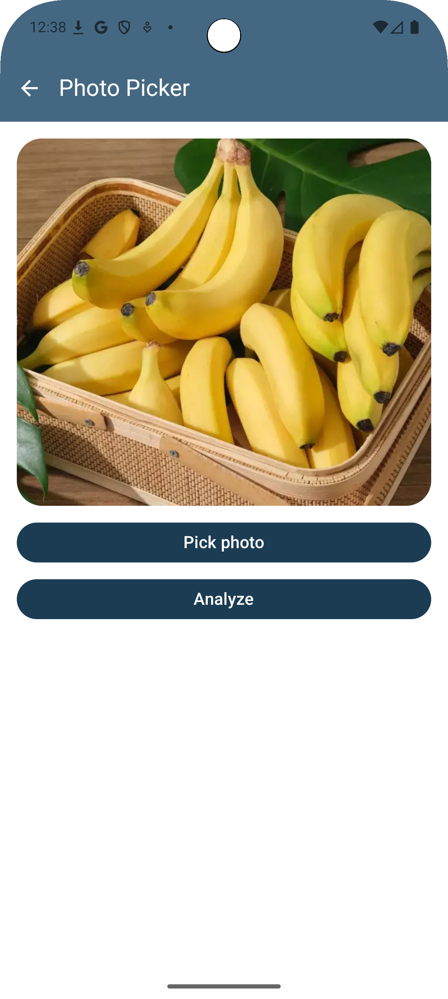

# Smart Waste Manage (Android)

Developed as part of the EBC-VA2 - Application Development for Android 2 course, the application designed to streamline waste management and collection in Brno, Czech Republic.
It allows users to identify types of waste using machine learning, locate the nearest recycling containers

# Set up
Before running, add this line to the local.properties: 

```
server="https://services6.arcgis.com/fUWVlHWZNxUvTUh8/arcgis/rest/services/kontejnery_separovany/FeatureServer/0/"
```

Add Google Map API key to the AndroidManifest.xml: 
```
  <meta-data android:name="com.google.android.geo.API_KEY"
            android:value="your_google_api"/>
```

## What i learned 
- Adopted MVVM architecture with Dependency Injection using Hilt
- ML Object Detection using a custom TensorFlow Lite mode
- Real-time visualization of waste containers in Brno using Google Maps with Clustering support for high-density areas
- Integration with Brno's ArcGIS Open Data services to provide up-to-date container locations
- Networking with Retrofit & OkHttp, json parsing using Moshi
- Local database using Room for caching waste collection history and container details.
- 
## Waste category

## Map

## Picker


